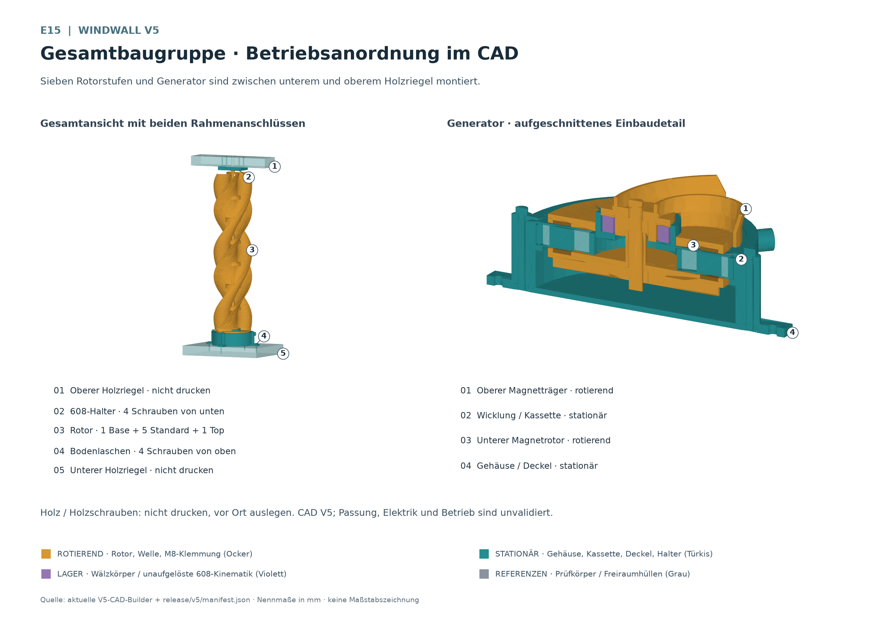
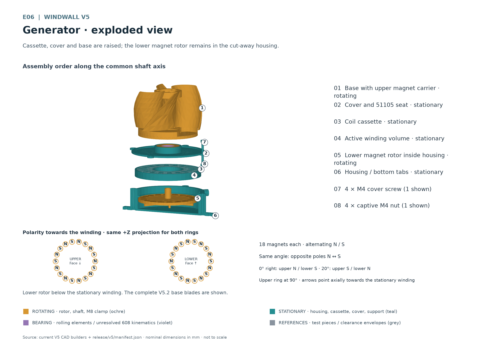
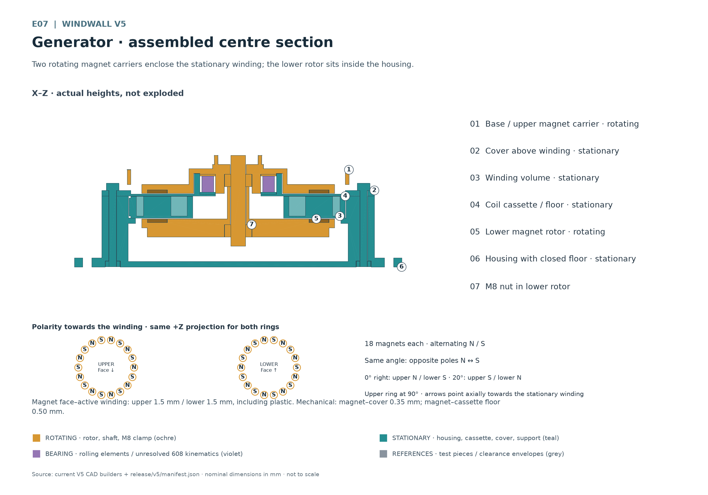
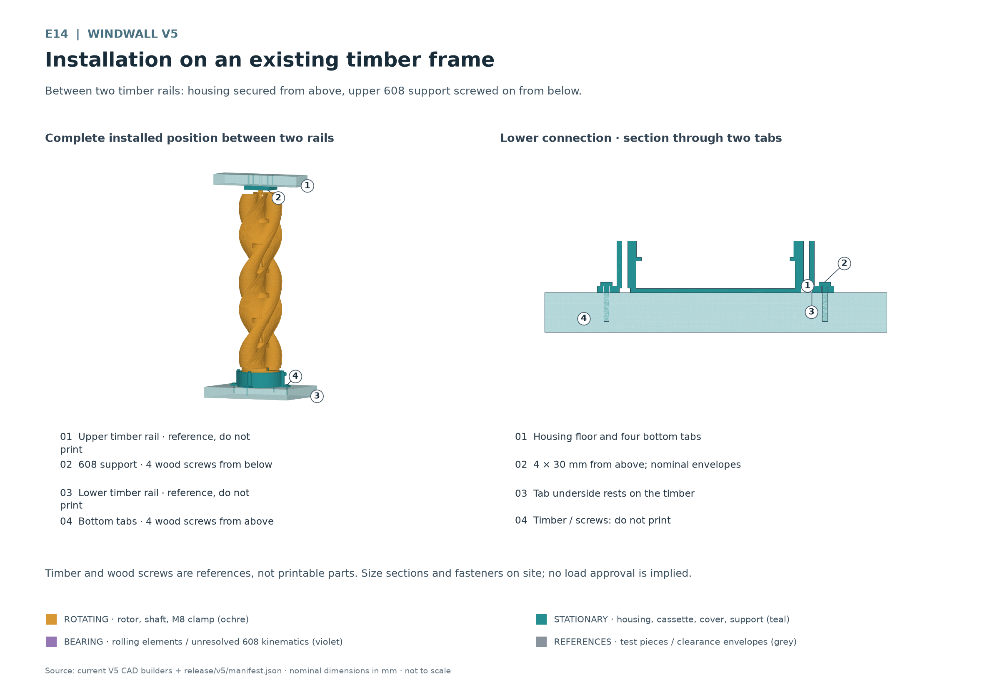

# Ugrinsky Wind Wall V5

A parametric CadQuery project for a seven-stage vertical-axis rotor and an
experimental axial-flux generator mounted between two timber rails. The repository
contains editable CAD source, verified geometry exports, assembly drawings, and
complete assembly and coil-experiment manuals in six languages.

**V5 is a prototype awaiting physical validation.** Geometry checks do not establish
power output, a safe maximum speed, fatigue life, weather resistance, or suitability
for unattended operation. Begin with fit coupons and a guarded workshop test rig.
The generator must not be connected directly to a 48 V lead-acid battery.



## Start here

The [release index](release/v5/release-index.json) is the complete portable inventory.
The [geometry manifest](release/v5/manifest.json) is authoritative for quantities,
dimensions, roles, file hashes, and CAD validation results.

| Assembly and experiment manual | Language |
| --- | --- |
| [English manual](release/v5/docs/Ugrinsky-Wind-Wall-V5-Manual-English.docx) | English · en-GB |
| [简体中文手册](release/v5/docs/Ugrinsky-Wind-Wall-V5-Manual-Chinese-Simplified.docx) | Simplified Chinese · zh-CN |
| [हिन्दी पुस्तिका](release/v5/docs/Ugrinsky-Wind-Wall-V5-Manual-Hindi.docx) | Hindi · hi-IN |
| [Manual en español](release/v5/docs/Ugrinsky-Wind-Wall-V5-Manual-Spanish.docx) | Spanish · es-ES |
| [Manuel en français](release/v5/docs/Ugrinsky-Wind-Wall-V5-Manual-French.docx) | French · fr-FR |
| [Deutsche Bauanleitung](release/v5/docs/Ugrinsky-Wind-Wall-V5-Bauanleitung.docx) | German source · de-DE |

Every manual preserves all 13 chapters, 11 tables and 15 current drawings. The five
translations include complete translated captions and alternative descriptions,
including the drawing labels. Shared raster drawings retain their German annotations.
Technical filenames remain unchanged.

The DOCX packages pass structural and accessibility checks. Rendering remains
blocked because bundled LibreOffice is unavailable on this Windows runtime; no PDF
or rendered-page approval is supplied. Pagination, clipping and Chinese/Hindi glyph
rendering require page-by-page visual review. No independent native-speaker review
is recorded.

## V5 architecture

The rotor has one base, five identical standard modules and one top module. Nominal
diameter is 122 mm, stage pitch is 70 mm and aerodynamic height is 490 mm. Each module
is one printed body with a 2 mm nominal blade wall. The base integrates the upper
magnet carrier. Permanent bayonet latches and tongue-and-groove blade seams join
adjacent stages; an M8 shaft and clamping hardware complete the rotating assembly.

The lower magnet rotor runs inside the closed-bottom housing, below the stationary
coil cassette. A keyed shoulder seats the cassette; a screwed cover retains it
from above. The 51105 thrust bearing transfers rotor weight to the stationary cover
and housing. The upper 608 bearing provides radial guidance in a separate support
attached beneath the upper timber rail.

| Rotates with the shaft | Remains stationary | Bearing motion |
| --- | --- | --- |
| Base and integrated upper magnet carrier | Housing and mounting tabs | 51105 shaft washer rotates with the base |
| Five standard modules and top module | Coil and keyed cassette | 51105 housing washer stays in the cover |
| Lower magnet rotor and both magnet rings | Cover and its six M4 fasteners | 51105 rolling elements have their own motion |
| M8 rod, three nuts, top washer and spacer | Upper support and timber frame | 608 inner ring follows the shaft; outer ring stays in its support |

Purple bearing envelopes do not resolve individual rolling-element motion. Grey
timber and screw envelopes are references, not printable parts or structural approvals.



## Printed parts and hardware

One complete V5 needs **12 printed bodies from 8 unique STL files**. Production STLs
are in [release/v5/stl](release/v5/stl/); each has a same-stem STEP in
[release/v5/step](release/v5/step/). STLs sit at print Z = 0, which does not choose
the best support strategy or printing orientation.

| Qty | STL filename | Function | Motion |
| --- | --- | --- | --- |
| 1 | `base_rotor_module.stl` | Base, integrated upper magnet carrier and bearing pilot | Rotating |
| 5 | `standard_rotor_module.stl` | Intermediate rotor stages | Rotating |
| 1 | `top_rotor_module.stl` | Final stage and reinforced top clamp seat | Rotating |
| 1 | `lower_magnet_rotor.stl` | Separate lower carrier inside the housing | Rotating |
| 1 | `generator_housing.stl` | Closed cup, cassette shoulder, cable outlet and mounting tabs | Stationary |
| 1 | `coil_cassette.stl` | Removable winding carrier and anti-rotation key | Stationary |
| 1 | `generator_cover.stl` | Cassette retention and 51105 housing seat | Stationary |
| 1 | `top_support.stl` | Upper 608 bearing support | Stationary |

Print the nine [coupon bodies](release/v5/coupons/) first:
`magnet_pocket_coupon.stl`, `51105_outer_seat_coupon.stl`, `25mm_pilot_coupon.stl`,
`608_seat_coupon.stl`, `coil_cassette_segment_coupon.stl`, `bayonet_male.stl`,
`bayonet_female.stl`, `joint_male.stl`, and `joint_female.stl`. Each also has a STEP.
Cut the male cassette arc free flush with its plate and deburr it before comparison.

| Qty | Purchased item | Selection notes |
| --- | --- | --- |
| 1 | M8 threaded rod | Extended shaft envelope 555.3 mm; establish actual cut length by dry assembly |
| 3 | M8 nuts | Two torque-transmitting nuts and one upper clamping nut |
| 1 | Top M8 washer | Nominal 24 mm outside diameter × 2 mm thickness |
| 1 | Spacer sleeve | Nominal 12 mm outside diameter × 17.85 mm length; verify M8 passage and clamping |
| 36 | Magnets | Two rings of 18; target 10 × 2 mm; measure coating and actual dimensions |
| 1 | Complete 51105 thrust bearing | 25 × 42 × 11 mm, including both washers and rolling elements |
| 1 | 608 radial bearing | 8 × 22 × 7 mm |
| 6 each | M4 cover screws and captive hex nuts | Select actual length and head from grip, nut height and floor clearance |
| 4 | Lower timber screws | Reference 4 × 30 mm, flat head Ø9; site-specific selection required |
| 4 | Upper timber screws | Reference 4 × 40 mm; site-specific selection required |

Also provide enamelled copper wire, insulated leads, suitable soldering and
insulation materials, tested magnet retention, strain relief and edge protection.
Test compatibility with enamel, magnet coating and print material before adhesive
or potting. Nominal hardware envelopes are not procurement or load-rating approvals.

## Printing and bearing fits

Start with **PLA on a Bambu P2S with a 0.4 mm nozzle**. Use the actual filament's
profile. A 0.20 mm layer height is an unvalidated starting point; set temperature,
cooling, walls, infill and supports from coupons and the complete slicer preview.
Confirm continuous toolpaths in the 2 mm blade wall. Bayonet roofs and undercuts
need verified bridges or removable supports. Keep support residue and elephant
foot off mating surfaces. Compare normal and inverted base orientations because
its installed magnet pockets face downwards.

Print coupons, then a real two-stage joint, then the full set. Record joining force,
cracks, seam alignment and play. **ASA is the intended later outdoor material trial**;
repeat fit, warping, retention and load tests after changing material. ASA alone does
not establish weatherproofing or long-term outdoor suitability. Follow the actual
filament and printer processing and ventilation instructions.

| Interface | Current CAD nominal | Coupon choices |
| --- | --- | --- |
| 51105 stationary outer seat | Ø42.2 mm × 11.2 mm seat depth | Ø42.0 / 42.2 / 42.4 mm |
| 51105 rotating base pilot | Ø24.8 mm | Ø24.6 / 24.8 / 25.0 mm |
| 608 upper support seat | Ø22.2 mm × 7.2 mm seat depth | Ø22.0 / 22.2 / 22.4 mm |
| Magnet pocket | Ø11.0 mm × 2.0 mm deep | Ø10.8 / 11.0 / 11.2 mm |
| Cassette radial clearance | Verify keyed fit and cover retention | 0.30 / 0.35 / 0.40 mm |

These are fit experiments, not approved press fits. The 51105 housing washer stays
in the cover and the shaft washer rotates with the base; both raceways face the
rolling elements. Identify parts by actual geometry and manufacturer markings.
Apply fitting force only to the ring or washer being seated.

The upper 608 outer ring stays in its support; timber closes the upward-open seat.
An M8 threaded rod is not a ground bearing journal. Any locally prepared running
surface needs measurement, controlled machining and rechecking of diameter, runout
and remaining section. Avoid a second axial clamp at the upper bearing. A printed
shaft guide sleeve is not specified.

## Magnet polarity and gap reference planes

Each ring has 18 coil-facing poles. Alternate **N S N S** around the upper ring.
At the same angle in a common +Z projection, the lower coil-facing pole is opposite:
upper N faces lower S, then upper S faces lower N. Mark a reference pocket and check
faces after flipping a carrier. Confirm retention independently before each rotation
test; open pockets alone do not establish centrifugal retention.



| Distance | Nominal | Reference surfaces |
| --- | --- | --- |
| Upper magnetic distance | 1.5 mm | Upper magnet face to active winding face, including cover plastic |
| Lower magnetic distance | 1.5 mm | Lower magnet face to active winding face, including cassette-floor plastic |
| Upper mechanical clearance | 0.35 mm | Magnet face to cover membrane |
| Lower mechanical clearance | 0.50 mm | Magnet face to cassette floor |
| Membrane and cassette-floor thickness | 1.00 mm each | Plastic included in the magnetic distances |
| Cassette upward retention travel | 0.15 mm | Cassette top to cover underside |

The 1.5 mm values require flush or recessed magnets. Adhesive, protrusion, winding
height, axial float and runout can reduce the minimum clearance. Measure both gaps
over a full hand revolution and with available axial play. Contact-free CAD does not
prove clearance under load. Correct rubbing; never use higher speed to clear it.

## Assembly sequence

Use the full manual for tooling, checks and service. The essential order is:

1. Measure hardware, validate coupons and check magnet retention and polarity.
   Prepare an insulated, removable test coil and lead strain relief.
2. Seat six captive M4 nuts. Put the lower rotor, its M8 torque nut, shaft and spacer
   inside the housing with magnet faces upwards. Keep nut and shaft clear of the floor.
3. Lower the cassette onto its shoulder, engage its key, align cable openings and
   route the protected cable.
4. Fit the stationary cover and tighten six M4 screws evenly in a crossing sequence.
   No PLA tightening torque is validated.
5. Install the 51105 housing washer, rolling elements and shaft washer correctly.
   Lower the base and upper torque nut, magnet faces down, controlling attraction
   with a fixture.
6. Check hand rotation and gaps. Add five standard modules and the top, locking each
   joint anticlockwise viewed from above. Check every latch and blade seam. Reverse
   disassembly can damage the permanent latches.
7. Fit the top washer and M8 nut; finish clamp adjustment before the upper bearing
   support. Do not bind stationary parts or bearings.
8. Fasten the housing's four tabs to the lower timber from above. Fit the 608 and
   fasten the upper support from below with four screws. Align both bearing axes;
   confirm full shaft engagement, end clearance and free rotation again.



E14 timber sections and screw envelopes are examples. Frame strength, fixings,
edge distances and wind loading require site-specific engineering. The upper
support guides radially; the lower 51105 carries the intended axial load. Service
the cassette from above with the rotor stack supported as one unit; routine coil
changes should not require unlocking its six permanent stage joints.

## Serpentine coil experiments

Route insulated wire through active pole regions in connected, repeated serpentines.
For this series, **one complete repetition of the same serpentine is one turn**.
Mark start A, end B and the path. With a few repetitions and hand rotation, verify
that successive active sections add voltage. Reversed sections or incorrect poles
can cancel it; the cassette does not define a validated electrical winding.

| Measured wire | Test turns | Keep comparable |
| --- | --- | --- |
| Initial 0.18 mm enamelled copper wire | 20 / 40 / 80 | Path, direction, recorded speed and defined load |
| Each future measured wire diameter | Repeat 20 / 40 / 80 | Measure conductor and enamelled outside diameter separately |

Record cold resistance, winding height, minimum gaps, speed, AC open-circuit
voltage, load value, loaded voltage/current, ambient and coil temperature, duration,
noise and vibration. Use instruments suited to the waveform. Rectifiers or pulsed
currents require appropriate DC or true-power measurement. Higher open-circuit
voltage does not establish useful loaded output. There is no final turn count or
validated power rating; each derived winding needs a physical test.

Do not connect directly to a 48 V lead-acid battery, even experimentally. A future
charging design needs measured electrical behaviour, rectification, compatible
charge regulation, reverse-current blocking, cable and short-circuit protection,
safe isolation and energy dissipation without a load. Any dump load needs thermal
and electrical design. No approved charging schematic is included.

## Repository and release layout

```text
src/windwall/              Parametric geometry, interfaces, validation and exports
scripts/                  CAD builds, previews, inspections and release indexing
scripts/manual/           German builder, figures and shared localization tools
scripts/manual/locales/   Five complete source-bound translation catalogues
tests/                    Geometry, export, drawing, manual and index regressions
docs/                     Design specifications, plans and measurement notes
release/v5/
  stl/                    Eight unique production meshes
  coupons/                Nine fit-coupon meshes
  step/                   Matching production and coupon solids
  assembly/               rotor_locked.step, generator.step, fence_assembly.step
  drawings/               E01–E15 PNGs, figures.json and drawing notes
  docs/                   German source and five translated DOCX manuals
  audits/                 German and multilingual structural/a11y evidence
  manifest.json           Geometry inventory and CAD audits
  release-index.json      Release files, sizes, hashes and validation bindings
build/                    Ignored previews, test outputs and rendering logs
reference/                External measurement references, not production meshes
```

Geometry uses `DesignParameters` and focused builders for blades, joints, generator,
bearings, housing and support. Assembly validation checks actual solids and exports,
identifying intentional contacts separately. `scripts/manual/manual_data.py` loads
release data without CAD. The German builder remains deterministic and independent
of localization.

The shared localization builder translates every source text run and figure
description while retaining layout, tables and image bytes. Catalogues bind to the
exact German DOCX hash. Coverage, numbers, technical filenames, language-specific
safety phrases and scripts are checked before writing. Explicit language metadata
and fonts use Arial for English/Spanish/French, Microsoft YaHei for Simplified Chinese
and Nirmala UI for Hindi.

## Build and test

Use Python 3.12 and [requirements.txt](requirements.txt) for CAD. From the repository
root, create or use the virtual environment. Every command importing CadQuery should
pass through the process-local Windows crash-dialog launcher:

```powershell
py -3.12 -m venv .venv
& ./.venv/Scripts/python.exe -m pip install -r requirements.txt
$env:PYTHONPATH = "$PWD;$PWD/src"
# Optional: set only to a real external reference file.
# $env:WINDWALL_REFERENCE_BLADE = '<reference-directory>/7 Ugrinsky_Blade.stl'
& ./.venv/Scripts/python.exe scripts/run_geometry.py -m unittest discover -s tests -v
$cadTestExit = $LASTEXITCODE
& ./.venv/Scripts/python.exe scripts/run_geometry.py scripts/build_v5.py --output-dir build/v5-check
$cadBuildExit = $LASTEXITCODE
Write-Output "CAD tests: $cadTestExit; CAD build: $cadBuildExit"
```

The optional reference enables the measured-source comparison. An unset variable
skips that test; a missing or wrong configured reference fails it. Keep downloaded
meshes external and retain their applicable source terms. Historical notes describe
their own stages; the V5 manifest and current manuals define this assembly.

A known native OCP shutdown failure can occur after passing assertions and valid
exports. Record the unittest result and process exit separately. The launcher
suppresses fault dialogs; it does not repair or conceal the native error.

DOCX creation and tests require the **bundled document Python returned by the Codex
workspace dependency loader**, separately from the CAD environment. On Windows:

```powershell
$documentRuntime = "$env:USERPROFILE/.cache/codex-runtimes/codex-primary-runtime"
$documentPython = "$documentRuntime/dependencies/python/python.exe"
& $documentPython -X utf8 scripts/manual/build_manual.py
& $documentPython -X utf8 scripts/manual/localize_manual.py
& $documentPython -X utf8 -m unittest tests.test_v5_manual tests.test_v5_i18n tests.test_release_index tests.test_v5_readme -v
& $documentPython -X utf8 scripts/manual/localize_manual.py --audit-only
```

Document authoring tests skip in the CAD runtime. The artifact-operation markers
for the German document and the five-document translation batch have already run;
do not repeat them for deterministic rebuilds. New artifact operations use the
document skill's marker once immediately before first authoring.

Run packaged accessibility/rendering QA, record evidence, then rebuild the index:

```powershell
& $documentPython -X utf8 scripts/manual/verify_translations.py
& $documentPython -X utf8 scripts/manual/localize_manual.py --audit-only --qa-directory build/manual-i18n-qa
& $documentPython -X utf8 scripts/index_v5.py
```

The QA wrapper restricts executable lookup to the bundle, preventing desktop
LibreOffice fallback. Missing rendering is recorded as blocked. When a bundled
renderer becomes available, inspect every page and update the audit workflow to
record the new evidence; its current writer rejects unexpected render results.
Intermediates remain in `build/`.

Regenerating geometry or drawings can invalidate manual evidence. Review and rebuild
dependent documentation before publishing another index. The index checks geometry,
source manifests, all drawing hashes, the German manual, all five translations,
catalogue hashes, sizes, locales and structural evidence. Missing languages, stale
reviews, altered files and unlisted release artifacts are rejected. Index generation
does not confer physical approval or perform a new human review.

## Safety and remaining validation

Use a guarded rig, controlled drive and reliable stop. Keep people, hair, clothing
and loose objects clear. Stop for rubbing, cracks, magnet movement, vibration,
unusual bearing noise, heating or loose fasteners. Before each session check
retention, screw marks, insulation and free rotation.

The user reported that a printed V4.3 bayonet coupon fits and closes; assembly force
and fatigue life remain unmeasured. Rigid CAD motion sweeps encounter permanent
pawls and lug roofs during insertion. Elastic behaviour needs physical tests despite
installed-geometry clearance checks. The joint coupon's 4.2 mm open-spoke hex recess
is a calibration feature, not a full-depth load-bearing M8 nut socket.

Magnet retention, printed bearing fits, clamping, shaft alignment, strength, fatigue,
balance, electrical output, thermal behaviour, overspeed and frame loading remain
unvalidated. The side outlet and housing are not waterproof. Wind operation, UV,
frost, water exposure, charging and unattended continuous use require further
engineering and physical evidence. This repository makes no measured efficiency
or power claims.
